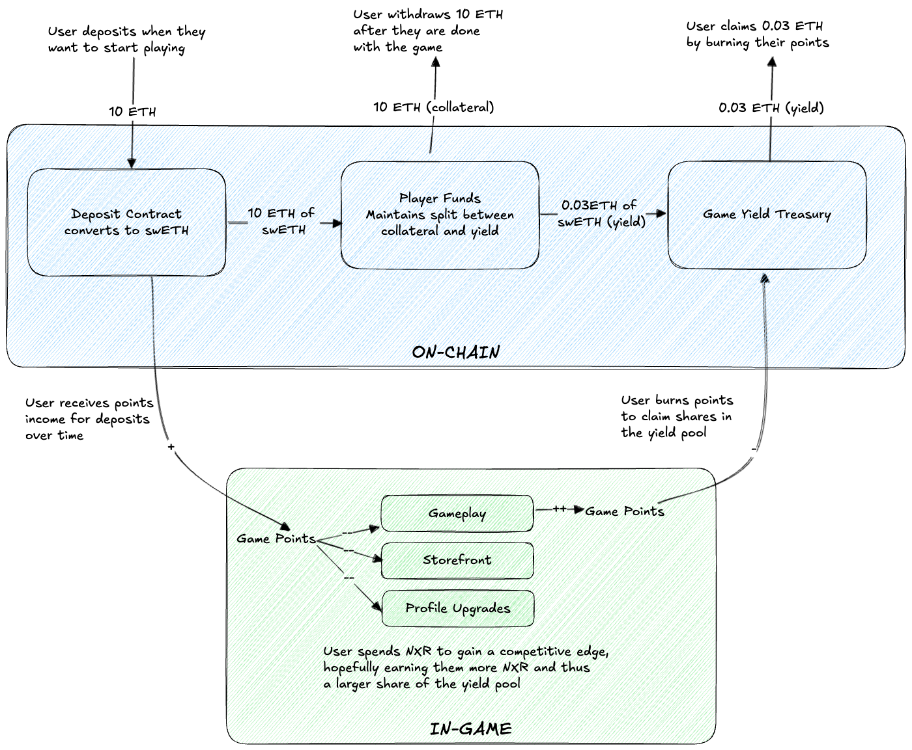

# Armory - A Game Wallet System for Blockchain Games

Armory is an accounting system that bridges blockchain and in-game accounts. A user's deposited collateral is converted to an LST or LRT, and the yield is stored in a global yield pool.

The idea is to enable blockchain-based games to have a more sustainable economy by having true value backing the game token via the global yield pool.

The user:

- Deposits their funds into the game wallet.
- Receives game token income for their deposited collateral.
- Withdraws their original collateral at any time (with a ~5 day wait).
- Spends the game token in-game to increase their competitive advantage.
- Burns the game token to claim from the global yield pool.
